# Martin Hunt

**`Scientific Software Developer`**

🔭 I'm currently working on **Writing software for Signal Processing and Hearing Research**

---

🤖 Like many developers, I'm currently learning best practices for incorporating Claude Code (and other AI coding tools) into the development process. As the technology rapidly progresses, it is becoming clear that our skillset must also evolve.  Additionally, the
tools we use to manage our code and projects must also adapt to accommodate the new capabilities and workflows that AI coding tools enable.

I am currently using AI coding tools primarily a as productivity enhancer.  The hype says we will eventually be able to use AI coding tools to write entire applications, but I think we are still a ways off from that.  No one has yet demonstrated that we can reliably use AI coding tools to write complex applications without significant human oversight and intervention.

The next few years will be very interesting as we shift paradigms from using AI coding tools as a productivity enhancer to using them as a primary development tool.

To reach the next step of using AI coding tools to write entire applications, we will need to develop new best practices for how to use these tools effectively.  We will also need to develop new workflows that are designed to work with AI coding tools.  In particular, new tools and processes for CI/CD, validation and acceptance specification and testing will be needed to fully realize the potential of AI coding tools.

Despite the alarming headlines about AI taking over programming jobs, I believe we are just at the beginning of a new era in software development.  The most successful developers will be those who can effectively leverage AI coding tools to enhance their productivity and creativity, while also maintaining a strong understanding of software engineering principles and best practices.

- 📫 How to reach me: **<huntmartinm@gmail.com>**

## 📸 Project Screenshot Gallery

Unfortunately, many of the projects I have worked on are proprietary and cannot be shared publicly. However, I have included screenshots of some of the applications I have developed in the last few yearsto provide a visual representation of my work. These screenshots showcase the user interfaces and features of the applications, giving insight into the types of projects I have been involved in. Please note that while the screenshots provide a glimpse into my work, they do not fully capture the complexity and functionality of the applications I have developed. If you are interested in learning more about my work or have specific questions about the projects, please feel free to reach out to me directly. I am happy to discuss my experience and the technologies I have used in more detail.

### Featured Projects

<table>
<tr>
<td width="60%">

**🎯 SpeechFit - Audiology Research Platform**

A comprehensive web application for conducting hearing research studies and managing participant sessions. Features include real-time data visualization, researcher dashboards, session management, and advanced acoustic analysis tools.

*Tech Stack: AWS, Python, FastAPI, Vue.js, PostgreSQL, NiceGUI*

</td>
<td width="40%">
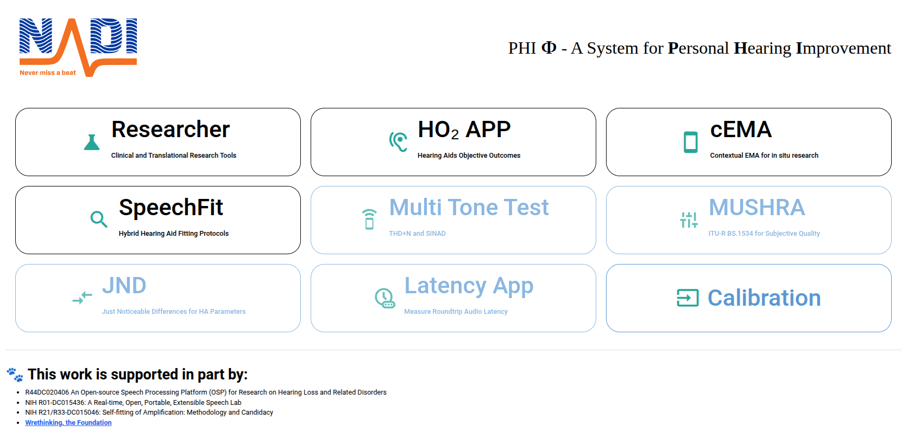
</td>
</tr>
</table>

<b>📷 View More SpeechFit Screenshots</b>

 
<table>
<tr>
<td width="50%">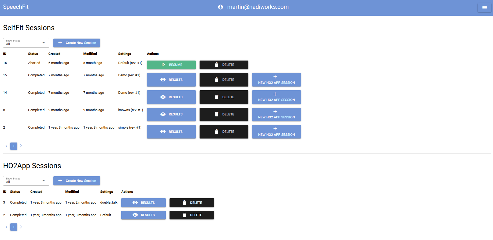 <i>Session Management Interface</i></td>
<td width="50%">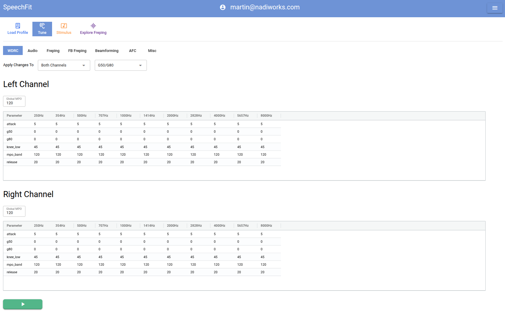 <i>Researcher Dashboard</i></td>
</tr>
<tr>
<td width="50%">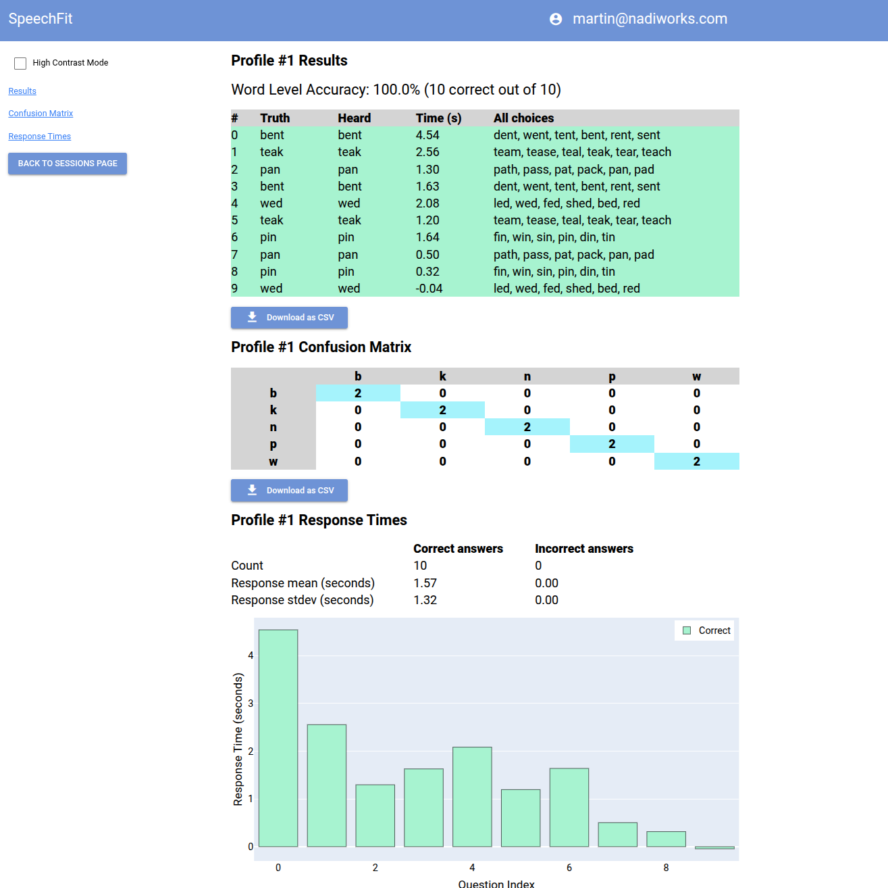 <i>HO2 Test Results Visualization</i></td>
<td width="50%">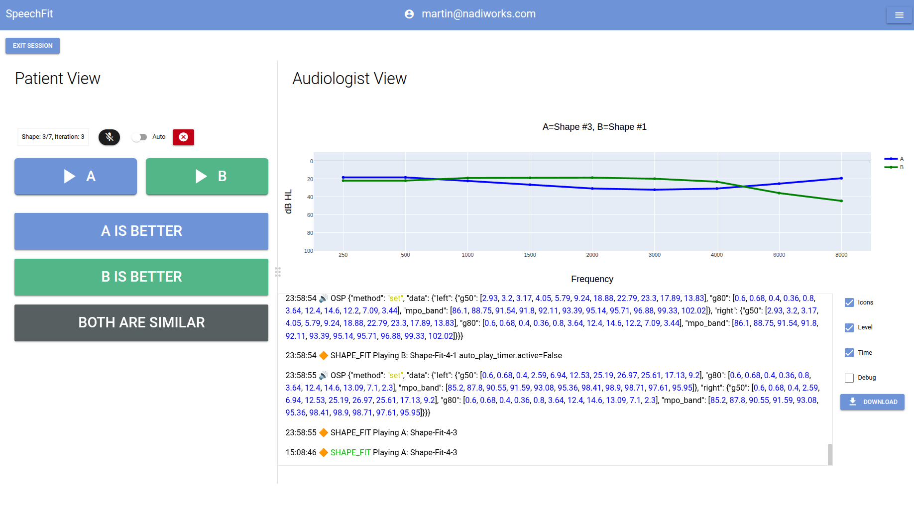 <i>Testing View</i></td>
</tr>
</table>

---

<table>
<tr>
<td width="60%">

**🧪 LTest - Hearing Testing Suite**

A hearing assessment tool providing comprehensive audiological testing capabilities. Includes automated test protocols, real-time threshold tracking, and detailed result reporting for clinical and research applications.

*Tech Stack: Python, NumPy, SciPy, Nuitka*

</td>
<td width="40%">
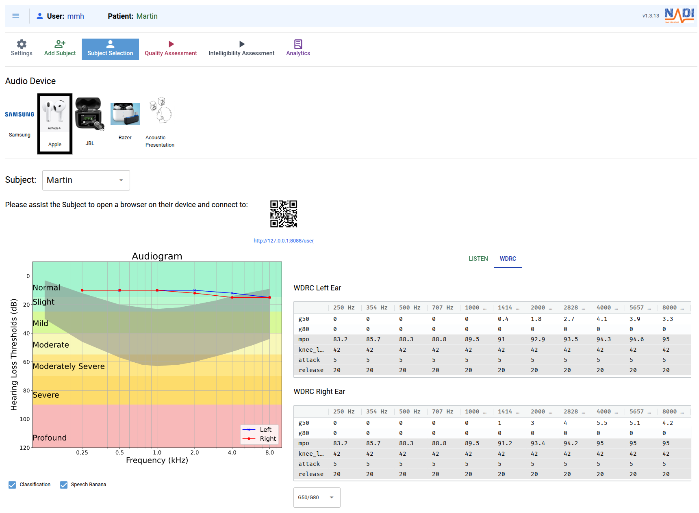
<i>Audiologist View</i></td>
</tr>
</table>

<b>📷 View More LTest Screenshots</b>

 
<table>
<tr>
<td align="center">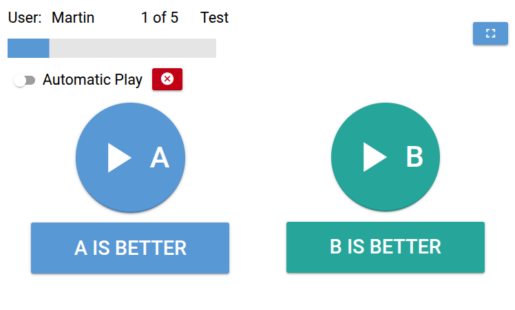 <i>Users View</i></td>
</tr>
<tr>
<td align="center" width="33%">
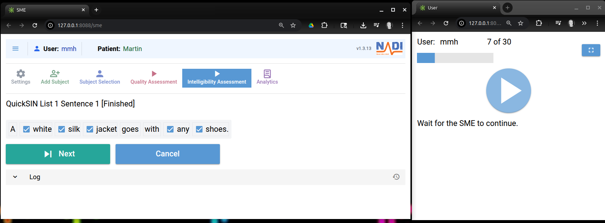
  
<b>🗣️ QuickSIN</b> 
Quick Speech-in-Noise assessment tool for evaluating hearing performance in noisy environments. Clinical-grade testing application.
</td>
</tr>
</table>

---

### Additional Tools & Applications

<table>
<tr>
<td align="center" width="33%">
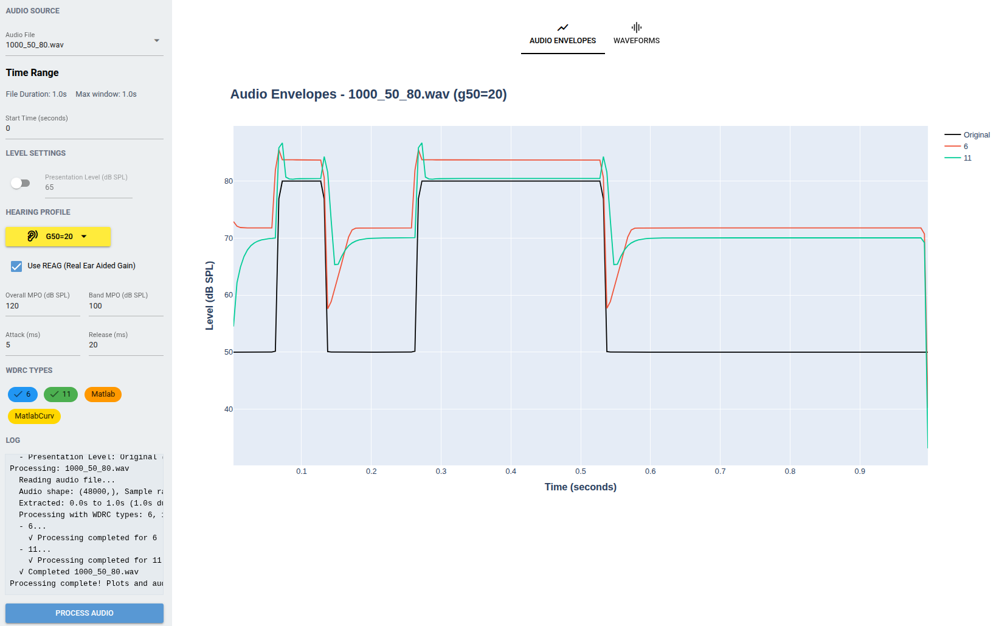
  
<b>🔊 WDRC Tool</b> 
Wide Dynamic Range Compression configuration Test and Verification tool for hearing aid algorithms. Allows comparison of different implementations.
</td>
<td align="center" width="33%">
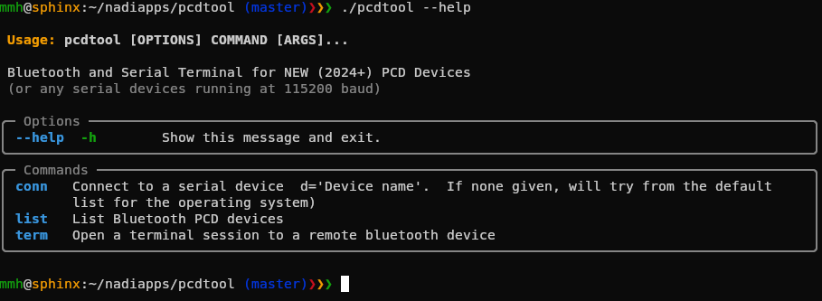
  
<b>📊 PCDTool</b> 
CLI tool to connect to our embedded devices by USB or Bluetooth.
</td>
<td align="center" width="33%">
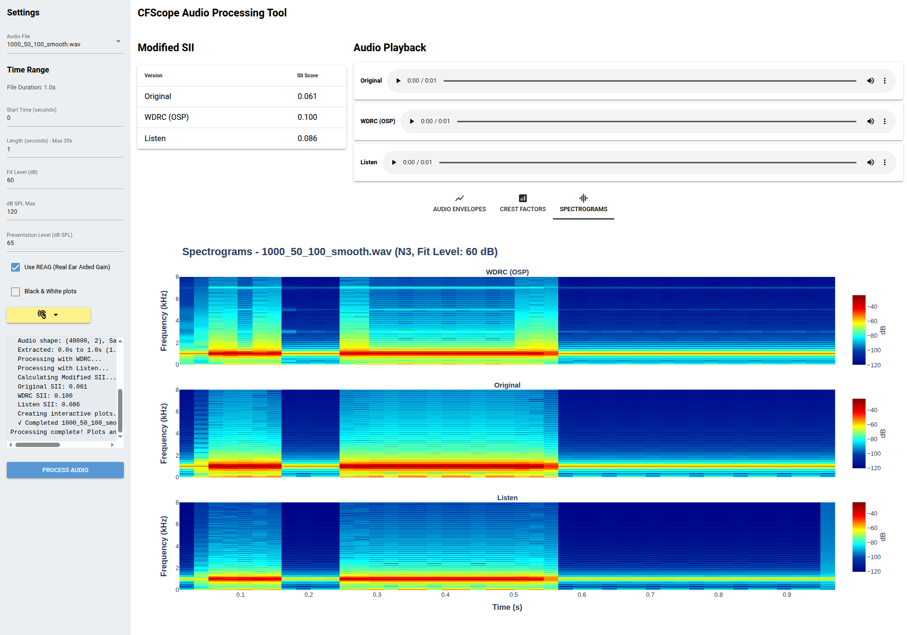
  
<b>🎚️ CFScope</b> 
Allows detailed measurement and comparison of processed audio signals. Useful for evaluating audio processing algorithms and hearing aid performance.
</td>
</tr>
<tr>
<td align="center" width="33%">
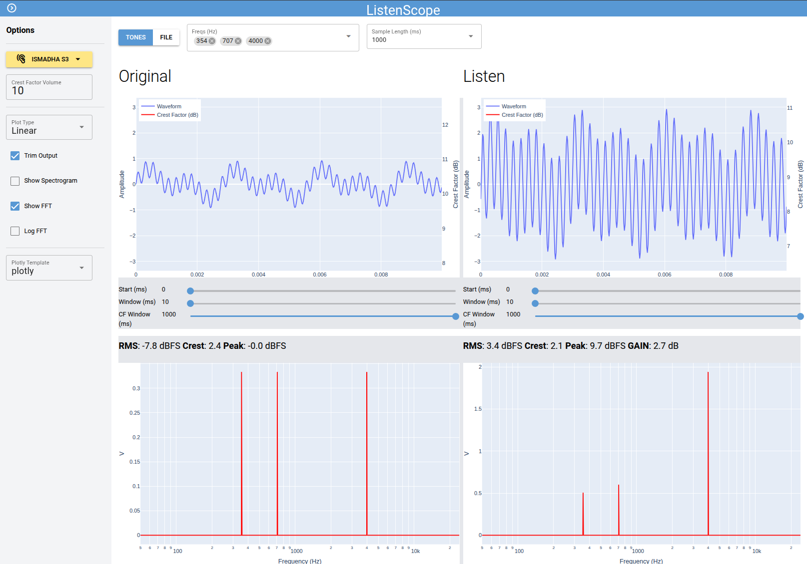
  
<b>📡 LScope</b> 
Similar to CFScope, LScope provides detailed measurement and comparison of processed audio signals, focusing on different aspects of audio analysis.
</td>
<td align="center" width="33%">
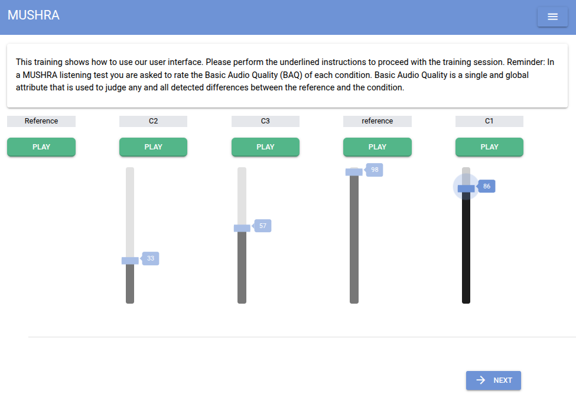
  
<b>🎵 MUSHRA</b> 
Multi-Stimulus test with Hidden Reference and Anchor implementation. Standard tool for subjective audio quality assessment in hearing research.
</td>
</tr>
<tr>
<td align="center" width="33%">
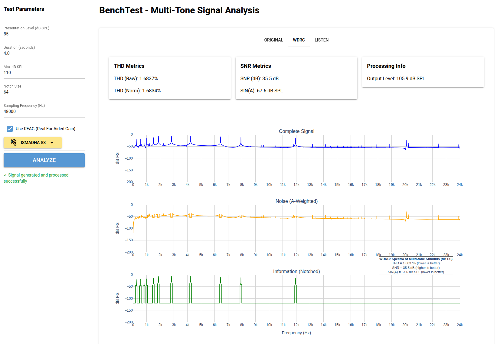
  
<b>⚡ BenchTest</b> 
Measures the SNR and THD of an audio signal when processed by different algorithms.
</td>
<td align="center" width="33%">
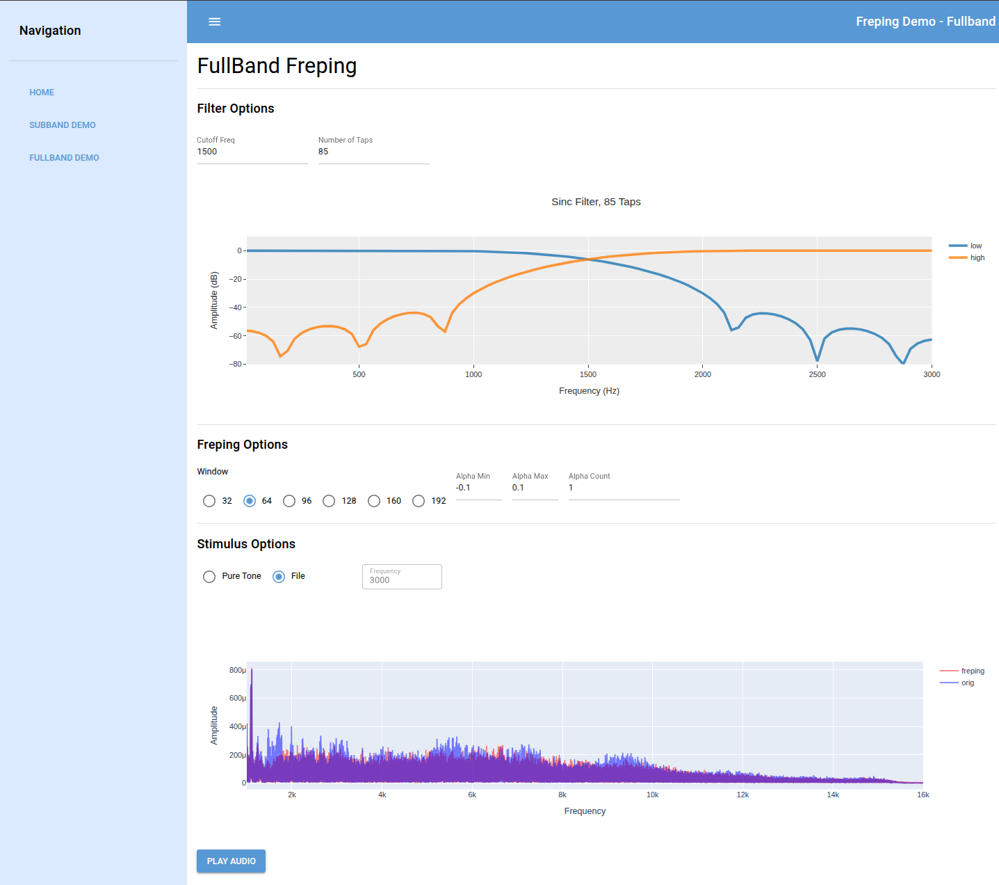
  
<b>🎼 Freping</b> 
Frequency Warping tool. Demonstrates the effects of frequency warping on audio signals.
</td>
<td align="center" width="33%">
</td>
</tr>
</table>

### Connect with me:

I don't really do social media, but you can find me on LinkedIn if you'd like to connect or learn more about my work experience and projects.

### Languages and Tools:

 

